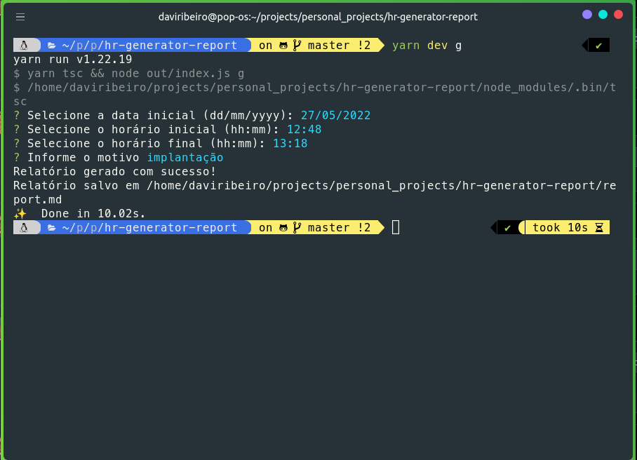
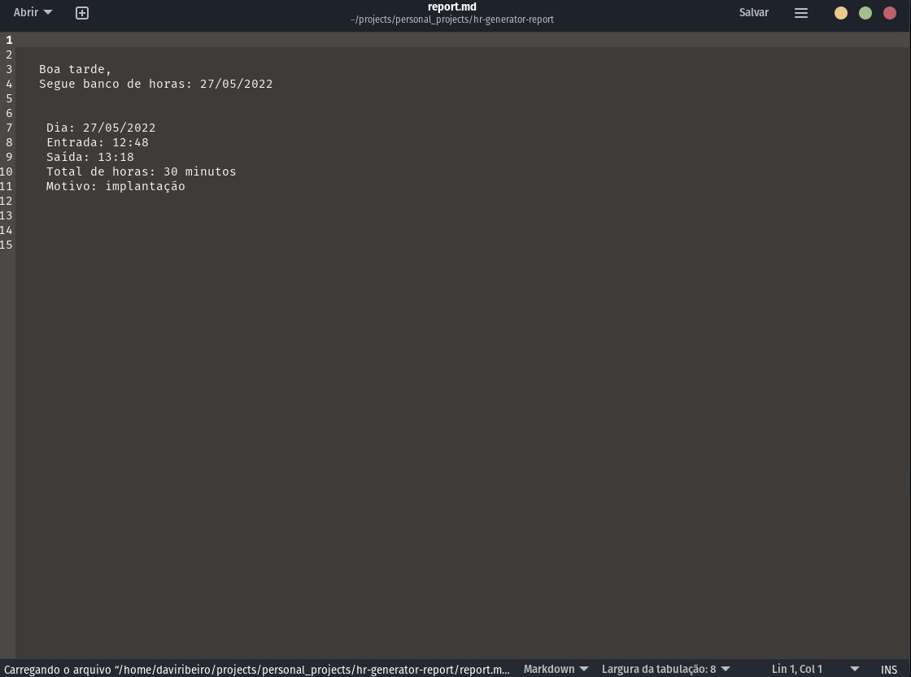

 ## HE Reports Generator
 

 ## installation


```sh
 $ yarn global add hr-generator-report 
```
```sh
 $ npm install -g hr-generator-report
```


## Use


### Generate template report week (7 days)

```sh
 $ hr init
```


####


### Generate one template report (1 day)

```sh
 $ hr generate
```

```sh
 $ hr init --month
```




